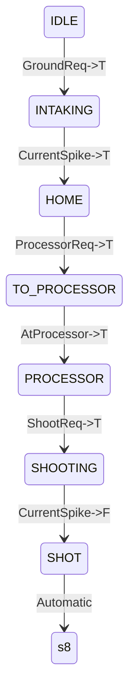

# Algae

## Motors

-   **Wrist**
    - 1 TalonFX: rotates vertically. It's technically a shoulder.
-   **Intake**
    -   1 TalonFX:intakes/scores algae.

## States

### State Diagram

Algae has its own state machine this year cuz its soooooo special like that.

### Output Truth Table

|    **State**     | **Intake**     |**Wrist**    | **Open Requests**  |
| :--------------: | :------------: | :--------:  | :----------------: |
|     **IDLE**     | Unrunning      |  HOME       | Ground             |
|**INTAKING**      | Intaking       |Move->GROUND |                    |
| **HOME**         | KeepIn         | Move->HOME  | Processor          |
| **TO_PROCESSOR** | KeepIn         |Move->PROC   | n/a                |
| **PROCESSOR**    | KeepIn         |PROC         | Shoot              |
| **SHOOTING**     | Shooting       | PROC        | n/a                |
| **SHOT**         | Unrunning      | Move->HOME  | n/a                |