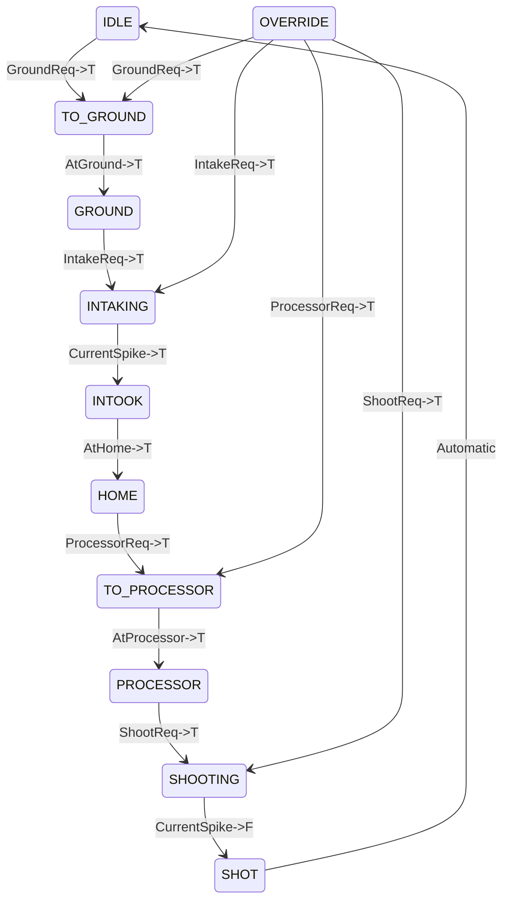

# Superstructure

## Motors

-   **Wrist**
    - 1 TalonFX: rotates vertically. It's technically a shoulder.
-   **Intake**
    -   1 TalonFX:intakes/scores algae.

## States

### State Diagram

Algae has its own state machine this year cuz its soooooo special like that. NOTE: OverrideReq->T at any state will go to OVERRIDE

### Output Truth Table

|    **State**     | **Intake**     |**Wrist**    | **Open Requests**  |
| :--------------: | :------------: | :--------:  | :----------------: |
|     **IDLE**     | Unrunning      |  HOME       | Ground, Override   |
|**TO_GROUND**     | Unrunning      |Move->GROUND | Override           |
|  **GROUND**      | Unrunning      | GROUND      | Intake, Override   |
|  **INTAKING**    | Intaking       | GROUND      | Override           |
|  **INTOOK**      | KeepIn         |Move->HOME   | Override           |
| **HOME**         | KeepIn         | HOME        | Processor, Override|
| **TO_PROCESSOR** | KeepIn         |Move->PROC   | Override           |
| **PROCESSOR**    | KeepIn         |PROC         | Shoot, Override    |
| **SHOOTING**     | Shooting       | PROC        | Override           |
| **SHOT**         | Unrunning      | Move->HOME  | n/a                |
| **OVERRIDE**     |Unrunning/KeepIn|Unknown      | All                |